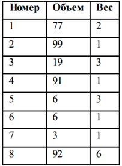
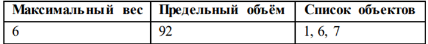

# obj-oracle-model

Имеется таблица со списком объектов, характеризующихся номером, объемом и весом. Необходимо создать запрос для определения списка различных объектов, для которых:
* суммарный объем будет ближе всех к предельной величине объёма при максимальном весе, но не будет превышать её;
* суммарный вес не будет превышать максимальный вес;
* если при одинаковом суммарном объёме получаются различные значения суммарного веса, решение должно быть принято в пользу меньшего.

Список не должен состоять из единственного объекта с параметрами, соответствующими заданным максимальному весу и объёму.

Задача решается с использованием раздела MODEL.

Например, для таблицы:

Результат должен быть:

